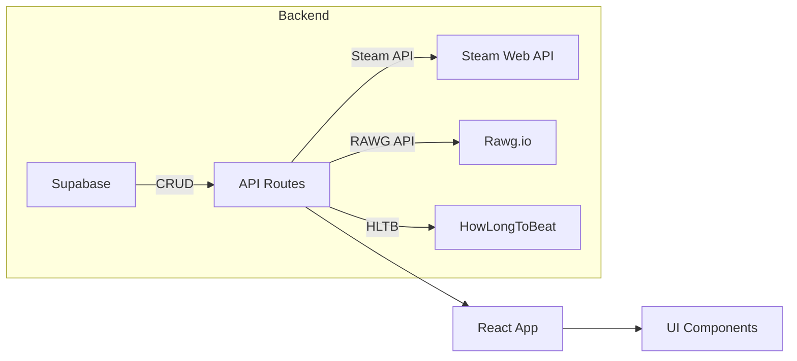

---

## title: Contexto del Proyecto Steam Dashboard

# Contexto y Requerimientos Generales

Este archivo define el **contexto** y los **requerimientos** para la IA encargada de generar el proyecto React completo para un dashboard de juegos de Steam.

## 1. Autenticación

* **Login**: formulario con `email` y `password`.
* **Register**: formulario con `email`, `username` y `password`.
* Validación de campos obligatorios y longitud mínima de contraseña.
* Al autenticar, se guarda un token JWT en `localStorage`.
* Rutas protegidas: `/dashboard` redirige a `/login` si no hay token.

## 2. Integración con Steam

* La IA debe usar la **Steam API** para obtener:

  * Lista de juegos poseídos (`GetOwnedGames`).
  * Lista de deseados (vía JSON no oficial de Steam).
* Se necesita el `steamid64` del usuario autenticado.
* El token de autenticación permite asociar cada cuenta de usuario con su SteamID en la base de datos.

## 3. Base de Datos en Supabase

* Configurar Supabase como backend:

  * Tabla `users`: `id`, `email`, `username`, `password_hash`, `steam_id`, `created_at`.
  * Tabla `sessions`: `id`, `user_id`, `token`, `expires_at`.
  * Tabla `games`: almacena métricas de cada juego para cada usuario:

    * `id`
    * `user_id` (FK)
    * `appid`
    * `name`
    * `cover_url`
    * `playtime_forever`
    * `hours_to_beat`
    * `metacritic_score`
    * `positive_reviews`
    * `negative_reviews`
    * `stars_rating`
    * `updated_at`

* La IA deberá generar código para:

  * Conectarse a Supabase con `@supabase/supabase-js`.
  * Operaciones CRUD para `users`, `sessions` y `games`.

## 4. Métricas de Juegos

* **Horas para completar**: usar `howlongtobeat` o fallback a playtime.
* **Puntaje Metacritic**: obtener vía API RAWG.
* **Opiniones Steam**: llamar al endpoint `appreviews` de Steam.
* **Cálculo de estrellas** con fórmula personalizada.

## 5. Frontend (React)

* Proyecto inicial con **Create React App (CRA)** + `npm`.
* **JSX** + **CSS Modules** para estilos.
* **Paleta de colores de Steam**:

  * Fondo: `#171A21`
  * Azul primario: `#66C0F4`
  * Gris claro: `#C6D4DF`s
  * Textos: blanco y `#C6D4DF`
* Componentes:

  * `Login.jsx`, `Register.jsx` (con `Auth.module.css`).
  * `Dashboard.jsx`, `GameTable.jsx`, `GameRow.jsx`, `Filters.jsx`.
* Hooks personalizados: `useAuth.js`, `useSortFilter.js`.
* Servicios de API con Supabase y fetch/axios en `services/api.js`.
* Flow de rutas con `react-router-dom`.

## 6. Flujo de Datos

## 7. Experiencia de Usuario

* Pantallas: `/login`, `/register`, `/dashboard`.
* En dashboard:

  * Tabla ordenable y filtrable.
  * Carga asíncrona con spinners.
  * Mensajes de error y éxito.

## 8. PROXIMAS FEATURES

> * Ver Wishlist en tabla
> * Agregar juegos aparte y almacenarlos en db
> * Tabla historica de juegos mas jugados (con los extras agregados)
> * Dashboard con juegos pendientes y sus scores
> * Dashboard con data de steam (Horas jugadas totales, plata gastada, etc.)

---
